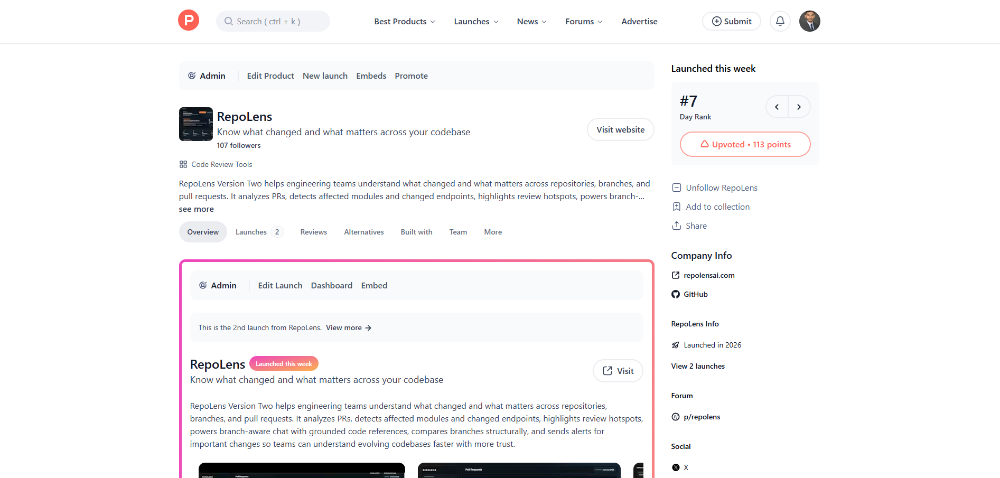
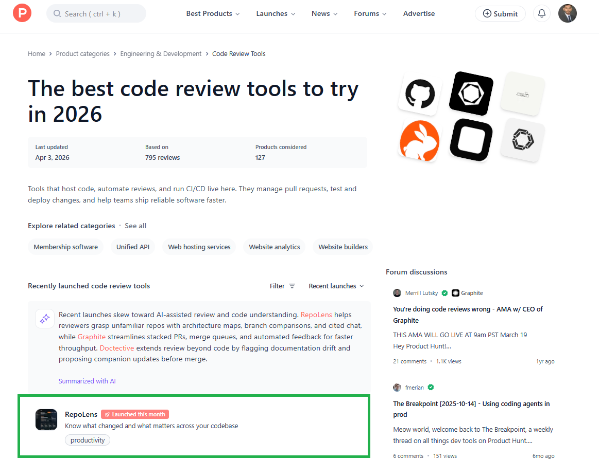

# RepoLens Community Edition

[](LICENSE)

Workspace version: `0.1.0`  
Distribution: source repository and local CLI workspace, not a published npm package

Open-source repository analysis for understanding a local codebase fast.

RepoLens Community Edition helps you inspect a repository from the command line and turn source code into a clear structural snapshot. It scans files, detects the stack, parses source code, extracts modules and API routes, builds dependency relationships, and generates architecture-oriented summaries.

## Featured On Product Hunt


As of April 3, 2026, RepoLens was featured by Product Hunt in its code review tools category, highlighted in recent launches, and recognized as Product of the Day #7.

If you found the project through Product Hunt, this repository is the open-source Community Edition focused on local repository analysis, architecture understanding, and CLI workflows.

- Product Hunt category: https://www.producthunt.com/categories/code-review-tools?order=recent_launches#content
- Product Hunt launch: https://www.producthunt.com/products/repolens
- Website: https://repolensai.com/
- GitHub: https://github.com/mohosin2126/repolens-community

If you would like to support RepoLens, you can vote on Product Hunt and star the project on GitHub.

## Feature Highlights

- Analyze any local repository path from the CLI
- Detect common stack signals from project metadata and structure
- Parse JavaScript and TypeScript source with AST-based analysis
- Extract logical modules and source-level metadata
- Build normalized dependency graph relationships
- Discover API endpoints from supported framework patterns
- Generate architecture and onboarding-oriented summary data
- Keep analysis local-first with no hosted dependency required

## Installation

Requirements:

- Node.js 20 or later
- npm 10 or later

Install dependencies and build the workspace:

```bash
npm install
npm run build
```

Useful workspace scripts:

- `npm run build` compiles the workspace once
- `npm run dev` watches TypeScript builds during development
- `npm run lint` runs ESLint across the repository
- `npm test` runs the Vitest suite
- `npm run analyze -- <path>` runs the local CLI after the workspace has been built
- `npm run explain -- <path>` prints a human-readable repository summary with a terminal-formatted overview

Additional setup notes are available in [docs/installation.md](docs/installation.md).

## Quick Start

Analyze the current repository:

```bash
npm run analyze -- .
```

Analyze another local repository:

```bash
npm run analyze -- "E:\path\to\other-repo"
```

Return the full analysis result as JSON:

```bash
npm run analyze -- . --json
```

Print a human-readable repository summary:

```bash
npm run explain -- .
npm run explain -- . --json
```

## Explain Command

Use `explain` when you want a more guided summary than the default `analyze` output.

```bash
npm run explain -- <repository-path>
npm run explain -- <repository-path> --json
```

The terminal output includes:

- a repository overview
- detected stack details
- likely entry points
- important modules to inspect first
- onboarding and architecture summaries

## CLI Usage Examples

Recommended workspace command:

```bash
npm run analyze -- <repository-path>
npm run analyze -- <repository-path> --json
npm run explain -- <repository-path>
```

Underlying CLI command:

```bash
node apps/cli/dist/index.js analyze <repository-path>
node apps/cli/dist/index.js explain <repository-path>
```

Analyze the included examples:

```bash
npm run analyze -- ./examples/express-basic
npm run analyze -- ./examples/nextjs-basic
npm run analyze -- ./examples/nextjs-basic --json
```

Browse the [examples directory](examples/) or start with [docs/examples.md](docs/examples.md) for fixture-specific usage notes and sample output.

The `explain` command highlights likely entry points and important modules alongside the repository summary.
Use `--json` with `explain` when you want the overview and summaries as a structured JSON document.

If the path is invalid, the CLI returns an error:

```bash
npm run analyze -- ./does-not-exist
```

## Sample Output

Example summary output for `./examples/express-basic`:

```text
Repository: express-basic
Scanned files: 5
Stack: JavaScript, TypeScript, Node.js, Express
Modules: 1
Dependencies: 0
API endpoints: 2
```

Example summary output for `./examples/nextjs-basic`:

```text
Repository: nextjs-basic
Scanned files: 7
Stack: JavaScript, TypeScript, Node.js, Next.js, React
Modules: 3
Dependencies: 0
API endpoints: 1
```

Use `--json` when you want the full structured analysis result for tooling, debugging, or downstream processing.

## Screenshots

The images below are the Product Hunt assets included in `docs/images`.

Product Hunt launch:



Recent code review tools highlight:



## Supported Frameworks And Languages

Current analysis support in this public repository focuses on:

- JavaScript
- TypeScript
- Node.js package metadata
- Express router definitions
- Next.js app router route handlers

The community edition is intentionally conservative. This README only lists support that is implemented in the current codebase.

## Community Edition Vs Cloud Edition

This repository contains only the Community Edition engine and local developer tooling.

| Area | Community Edition | Cloud Edition |
| --- | --- | --- |
| Repository analysis | Local CLI analysis of local paths | Private product surface, not included here |
| Source parsing and graphing | Included | Included privately, not documented here |
| API extraction | Included for supported local patterns | Private product surface, not included here |
| Hosted access to private repositories | Not included | Cloud-only |
| Authentication and OAuth | Not included | Cloud-only |
| Collaboration and team workflows | Not included | Cloud-only |
| Billing and subscriptions | Not included | Cloud-only |

If a feature depends on hosted services, private repository access, account management, or team collaboration, it does not belong in this public repository.

## Repository Structure

```text
packages/shared-types  Reusable analysis contracts and public result types
packages/parser-core   Scanning, stack detection, AST parsing, extraction helpers
packages/graph-core    Dependency graph and architecture relationship utilities
packages/core          End-to-end local analysis pipeline and summaries
apps/cli               Local command-line interface
examples               Small sample repositories for trying the analyzer
docs                   Installation, architecture, CLI, examples, and roadmap documentation
```

## Documentation

- [Installation](docs/installation.md)
- [CLI](docs/cli.md)
- [Architecture](docs/architecture.md)
- [Examples](docs/examples.md)
- [Feature Boundary](docs/feature-boundary.md)
- [Roadmap](ROADMAP.md)
- [Contributing](CONTRIBUTING.md)

## Local Development

Useful workspace commands:

```bash
npm run build
npm run dev
npm run lint
npm test
npm run analyze -- .
npm run explain -- .
```

Common workflow:

1. Install dependencies with `npm install`.
2. Build the workspace with `npm run build`.
3. Use `npm run dev` if you want TypeScript builds to keep watching while you work.
4. Run `npm run analyze -- <path>` against a local repository.
5. Run `npm run lint` and `npm test` before sending changes.

## Roadmap

RepoLens Community Edition is focused on improving the local analysis engine and its public developer experience.

Current roadmap themes:

- better local repository scanning and ignore handling
- stronger stack and framework detection
- broader parser coverage for supported JavaScript and TypeScript patterns
- richer module, graph, and architecture summaries
- better examples, tests, and contributor docs

See [ROADMAP.md](ROADMAP.md) for the maintained roadmap and explicit non-goals.

## Contributing

Contributions are welcome if they keep the project local-first, analysis-focused, and community-safe.

Before opening a pull request:

- keep changes small and review-friendly
- avoid introducing SaaS-only abstractions or features
- run `npm run build`, `npm run lint`, and `npm test`
- update docs or examples when behavior changes

See [CONTRIBUTING.md](CONTRIBUTING.md) for contribution guidelines and scope guardrails.
